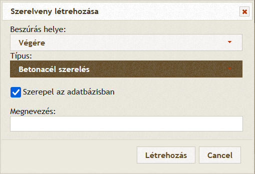
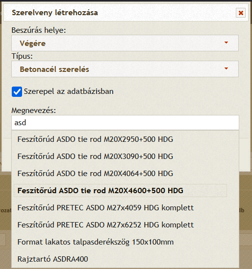
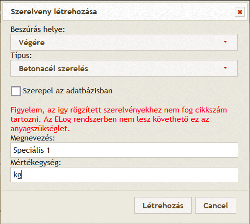

## ELog (Unit4) modul

### Bevezető

Az ELog modul SOAP XML kommunikációt használ az adatcserére. Mivel a DVB rendszere PHP-ba készült ezért a PHP SOAP külső
modul használata javasolt. Viszont ezen külső modul nem támogatja az egyedi XML üzenetek összeállitását, melyre jelen
esetben szükség van.

Az Elog modul osztálya a `/php/elog.php` fájlban található, mely include esetén létrehoz egy $elog példányt, mely
globálisan elérhető. Az általános SOAP kommunikációra a `sendSOAPRequest` metódus használható, mely CURL segítségével
segít elküldeni a SOAP kéréseket az ELog felé.

```phpregexp
sendSOAPRequest(url, payload)
  url: a kérés urlje string formátumban. 
  payload: XML kérés string formátumban
  visszatérési érték: XML formátumú string
```

Az ELog domaint a `php/config.php` fájlban lévő globális `$config ['elog_domain']` változó állítja be.

### Cikkszámok tükrözése

A cikkszámok lekérdezése a `ItemGetList3` nevű SOAP metóduson keresztül történik. 1 db `Filters` nevű paramétert vár,
melynek 2 db paramétere van: `Active` jelöli hogy aktiv-e ez a filter és a CompanyAbbrs mely egy lista, hogy milyen
projekt cikkszámaira vagyunk kiváncsiak.

A következő példa kérés 1 `Filtert` állit be, mely aktiv és a `B0120` kódjelű projekt cikkszámait hivatott lekérdezni:

```xml

<soapenv:Envelope xmlns:soapenv="http://schemas.xmlsoap.org/soap/envelope/" xmlns:tem="http://tempuri.org/">
    <soapenv:Header/>
    <soapenv:Body>
        <tem:ItemGetList3>
            <tem:Item>
                <tem:Filters>
                    <tem:Active>1</tem:Active> <!-- 0 = inaktiv szürőfeltétel, 1 = aktiv a szürő feltétel -->
                    <tem:CompanyAbbrs>
                        <tem:CompanyAbbr>XXXXX</tem:CompanyAbbr> <!-- XXXXX-es projekt -->
                    </tem:CompanyAbbrs>
                </tem:Filters>
            </tem:Item>
        </tem:ItemGetList3>
    </soapenv:Body>
</soapenv:Envelope>
```

A válasz a következő formátumú.

```xml
<?xml version="1.0" encoding="utf-8"?>
<soap:Envelope xmlns:soap="http://schemas.xmlsoap.org/soap/envelope/"
               xmlns:xsi="http://www.w3.org/2001/XMLSchema-instance" xmlns:xsd="http://www.w3.org/2001/XMLSchema">
    <soap:Body>
        <ItemGetList3Response xmlns="http://tempuri.org/">
            <ItemGetListResponse3>
                <Items>
                    <ItemGetListResponseItem3>
                        <ItemId>41991</ItemId>
                        <ItemCode>CX52110002AA0001</ItemCode>
                        <Name>Test1</Name>
                        <Name2/>
                        <Name3/>
                        <Unit>db</Unit>
                        <ExtCode/>
                    </ItemGetListResponseItem3>
                    <ItemGetListResponseItem3>
                        <ItemId>43722</ItemId>
                        <ItemCode>251X2252815014686</ItemCode>
                        <Name>Test2</Name>
                        <Name2/>
                        <Name3/>
                        <Unit>db</Unit>
                        <ExtCode/>
                    </ItemGetListResponseItem3>

                    ...

                </Items>
            </ItemGetListResponse3>
        </ItemGetList3Response>
    </soap:Body>
</soap:Envelope>
```

Az egyes `ItemGetListResponseItem3` blokkok jelentik a különálló cikkszámú elemeket:

```xml

<ItemGetListResponseItem3>
    <ItemId>41991</ItemId> <!-- egyedi azonsító az ELog rendszerében -->
    <ItemCode>CX52110002AA0001</ItemCode> <!-- cikkszám -->
    <Name>Test1</Name> <!-- megnevezés -->
    <Name2/> <!-- alternativ nevek -->
    <Name3/> <!-- alternativ nevek -->
    <Unit>db</Unit> <!-- mértékegység -->
    <ExtCode/> <!-- külső rendszerekben használt kód -->
</ItemGetListResponseItem3>
```

A cikkszámok lekérdezése napi egyszer történik. A napi első felhasználói bejelentkezés inditja el a háttérfolymatot,
melynek a `$elog->checkLastSyncAndStart()` metódus a belépési pontja. A háttérben az `$elog->processItemList()` metódusa
lekéri a cikkszámokat, majd SQL műveletekké alakitja őket. 1 cikkszám 1 SQL művelet. Az SQL müveleteket tömbösitve
tranzakcióként hajtja végre. A visszakapott cikkszámlista alapján törli azokat a bejegyzéseket, melyek már nem
szerepelnek az ELog rendszerében.

A lekérdezés sikeressége/sikertelensége a felhasználói naplóban megtekinthető és a következő formátumban olvasható:

```
2022-09-20 18:59:05 - ELog: cikkszám szinkronizáció befejeződött. Összesen: 38395 db cikkszám szinkronizálva.
2022-09-20 18:58:53 - ELog: XXXXX-es projekt cikkszámainak lekérése.
2022-09-20 18:58:52 - ELog: cikkszám szinkronizáció megkezdődött.
```

A cikkszámok a következő táblában vannak tárolva ahol az `id` (ELog: ItemId) a kulcs:

```mysql
CREATE TABLE `szerelveny_elog`
(
    `id`        bigint(20)                                NOT NULL,
    `item_code` varchar(32) COLLATE utf8mb4_hungarian_ci  NOT NULL,
    `name`      varchar(128) COLLATE utf8mb4_hungarian_ci NOT NULL,
    `name2`     varchar(128) COLLATE utf8mb4_hungarian_ci NOT NULL,
    `name3`     varchar(128) COLLATE utf8mb4_hungarian_ci NOT NULL,
    `unit`      varchar(16) COLLATE utf8mb4_hungarian_ci  NOT NULL,
    `ext_code`  varchar(32) COLLATE utf8mb4_hungarian_ci  NOT NULL
) ENGINE = InnoDB
  DEFAULT CHARSET = utf8mb4
  COLLATE = utf8mb4_hungarian_ci;

ALTER TABLE `szerelveny_elog`
    ADD PRIMARY KEY (`id`);
```

### Szerelvények társitása/módositása a DVB rendszer felületén:

A szerelvény társitása az adott elemtipushoz a következőképpen módosult. A `szerepel az adatbázisban` checkbox alapértelmezetten ki van jelölve. Ez azt jelenti hogy a megnevezés mezőben az ELog rendszerben felvitt elemeket lehet kiválasztani.



Minimum 2 karakter leütése után a rendszer felajánlja a beirt szöveghez legközelebb eső találatokat. A találatok JSON formátumban érkeznek a DVB rendszerből a `$szerelveny->jsonSzerelvenyek();` metóduson keresztül. 
A megnevezés pontosabb megadása esetén a találati lista szűkül. 



Amennyiben olyan szerelvényt kivánunk felvinni ami nem szerepel és nem is fog szerepelni az ELog-ban (egyedi szerelvény), akkor a `szerepel az adatbázisban` checkbox-ból a kiválasztást ki kell venni. Ebben az esetben meg kell adni a szerelvény megnevezését és mértékegységét.
Ezek a szerelvények nem kerülnek átküldésre az ELog rendszerbe.



### Elemlista küldése

Az elemlista küldése a `ProductAddOrUpdateRequest3` nevű SOAP metóduson keresztül történik. Paraméterként küldjük a
szinkronizálandó elemek listáját a következő formátumban:

```xml
<?xml version="1.0" encoding="utf-8"?> <!-- Fontos mert ékezetes karakereket is küldünk -->
<soapenv:Envelope xmlns:soapenv="http://schemas.xmlsoap.org/soap/envelope/" xmlns:tem="http://tempuri.org/">
    <soapenv:Header/>
    <soapenv:Body>
        <tem:AddOrUpdate>
            <tem:ProductAddOrUpdateRequest3>
                <tem:Products>
                    <tem:Product>
                        <tem:CompanyAbbr>B0120</tem:CompanyAbbr>
                        <tem:Id>48809</tem:Id>
                        <tem:ProjectCode>P22106</tem:ProjectCode>
                        <tem:ElementCode>3629</tem:ElementCode>
                        <tem:ElementName>PILLÉR</tem:ElementName>
                        <tem:ElementFullName>PILLÉR</tem:ElementFullName>
                        <tem:ProdPlanDate>2022-10-10</tem:ProdPlanDate>
                        <tem:Quantity>1</tem:Quantity>
                        <tem:ConcreteVU>1.17</tem:ConcreteVU>
                        <tem:RebarsMU>0</tem:RebarsMU>
                        <tem:HaspMU>0</tem:HaspMU>
                    </tem:Product>
                    <tem:Product>
                        <tem:CompanyAbbr>B0120</tem:CompanyAbbr>
                        <tem:Id>48809</tem:Id>
                        <tem:ProjectCode>P22106</tem:ProjectCode>
                        <tem:ElementCode>3629</tem:ElementCode>
                        <tem:ElementName>PILLÉR</tem:ElementName>
                        <tem:ElementFullName>PILLÉR</tem:ElementFullName>
                        <tem:ProdPlanDate>2022-10-10</tem:ProdPlanDate>
                        <tem:Quantity>1</tem:Quantity>
                        <tem:ConcreteVU>1.17</tem:ConcreteVU>
                        <tem:RebarsMU>0</tem:RebarsMU>
                        <tem:HaspMU>0</tem:HaspMU>
                    </tem:Product>

                    ...

                </tem:Products>
            </tem:ProductAddOrUpdateRequest3>
        </tem:AddOrUpdate>
    </soapenv:Body>
</soapenv:Envelope>
```

Egy adott gyártási elem a következőképp épül fel:

```xml

<tem:Product>
    <tem:CompanyAbbr>B0120</tem:CompanyAbbr> <!-- Projekt neve - mindig B0120 -->
    <tem:Id>48809</tem:Id> <!-- Gyártási elem DVB azonosítója a gyartastervezes táblából -->
    <tem:ProjectCode>P22106</tem:ProjectCode> <!-- Projekt munkaszáma DVB azonosítója a gyartasjelentes táblából -->
    <tem:ElementCode>3629</tem:ElementCode> <!-- Elem jele a gyartasjelentes_elem táblából -->
    <tem:ElementName>PILLÉR
    </tem:ElementName> <!-- Elem generált besorolása az elemjel első karakteréből. Besorolási táblázatot lejebb találod -->
    <tem:ElementFullName>PILLÉR</tem:ElementFullName> <!-- Elem teljes neve a gyartasjelentes_elem táblából -->
    <tem:ProdPlanDate>2022-10-10</tem:ProdPlanDate> <!-- Elem gyártási ideje a gyartastervezes táblából -->
    <tem:Quantity>1</tem:Quantity> <!-- Ez mindig 1, mert egy fizikai kiöntött elemet jelez -->
    <tem:ConcreteVU>1.17
    </tem:ConcreteVU> <!-- Elem betonszükséglete a gyartasjelentes_elem táblából a terfogat1 + terfogat2 értékek (van 2 féle betonból készülő elem is) -->
    <tem:RebarsMU>0
    </tem:RebarsMU> <!-- Elem vasszükséglete. A betonacél modul számolja ki ami a betonacel.php fájlban található -->
    <tem:HaspMU>0</tem:HaspMU> <!-- Elem pászma felhasználása. A gyartasjelentes_elem táblában a paszma érték -->
</tem:Product>

```

A gyártásra ütemezett elemek szinkronizálása óránként egyszer történik. A háttérfolyamat belépési pontja
a `$elog->checkLastSyncAndStart()` metódus (ugyanaz mint az cikkszám szinkronizációnak). A háttérben
az `$elog->prepareAndSendElemLista()` metódusa, mely SQL utasítással lekéri az összes gyártásra ütemezett vagy 1
hónapnál nem régebben legyártott elemeket. Ezek segítségével összeállitja a SOAP kérést és elküldi az ELog rendszer
felé. A válaszüzenetből kiolvassa, hogy mely elemek szinkronizálása nem sikerült és a felhasználói naplóba irja.

A szinkronizáció sikeressége/sikertelensége a felhasználói naplóban megtekinthető és a következő formátumban olvasható:

```mysql
2022-09-23 20:25:23 - Elog: Néhány elem szinkronizációja nem sikerült a következő miatt: Nem elérhető projektek az ELog-ban: P22106, P21034. Ismeretlen projektek az ELog-ban: P22194, P22184, P22162, P22153. A következő alkalommal újrapróbálkozik a szinkronizációval a rendszer.
2022-09-23 20:25:23 - ELog: elem szinkronizáció befejeződött. Összesen: 465 db gyártási napló bejegyzés elküldve az ELog-ba.
2022-09-23 20:25:15 - ELog: B0120-as projekt elemeinek szinkronizálása.
```

### Elemszükséglet küldése

Az elemszükségletet a következő formátumban kell küldeni:

```xml
<?xml version="1.0" encoding="utf-8"?>
<soapenv:Envelope xmlns:soapenv="http://schemas.xmlsoap.org/soap/envelope/" xmlns:tem="http://tempuri.org/">
    <soapenv:Header/>
    <soapenv:Body>
        <tem:MaterialRequirementsAdd>
            <tem:ProductMaterialRequirementsAddRequest3>
                <tem:Items>
                    <tem:Item>
                        <tem:ProductId>49194</tem:ProductId> <!-- DVB elem gyártási azonosítója - gyártástervezés tábla id mezője-->
                        <tem:ProductPlace>dvb Kft._Szeged</tem:ProductPlace> <!-- gyártóhely -->
                        <tem:StdTimeMinutes>0</tem:StdTimeMinutes> <!-- nincs definiálva -->
                        <tem:Requirements> <!-- szerelvények -->
                            <tem:Item>
                                <tem:Id>38421</tem:Id> <!-- szerelvény dvb azonosítója, gyártásjelentés_elem_szerelvény tábla id mezője -->
                                <tem:ItemId>33321</tem:ItemId> <!-- ELog azonosító -->
                                <tem:Quantity>2</tem:Quantity> <!-- ELog-ban használt mértékegységben a mennyiség -->
                            </tem:Item>
                            <tem:Item>
                                <tem:Id>38423</tem:Id>
                                <tem:ItemId>1366</tem:ItemId>
                                <tem:Quantity>9.8</tem:Quantity>
                            </tem:Item>
                            
                            ...
                            
                        </tem:Requirements>
                    </tem:Item>
                    <tem:Item>
                        <tem:ProductId>49181</tem:ProductId>
                        <tem:ProductPlace>dvb Kft._Szeged</tem:ProductPlace>
                        <tem:StdTimeMinutes>0</tem:StdTimeMinutes>
                        <tem:Requirements>
                            <tem:Item>
                                <tem:Id>38382</tem:Id>
                                <tem:ItemId>33321</tem:ItemId>
                                <tem:Quantity>2</tem:Quantity>
                            </tem:Item>
                            <tem:Item>
                                <tem:Id>38383</tem:Id>
                                <tem:ItemId>1366</tem:ItemId>
                                <tem:Quantity>9.8</tem:Quantity>
                            </tem:Item>
                            
                            ...
                            
                        </tem:Requirements>
                    </tem:Item>
                    
                    ...
                    
                </tem:Items>
            </tem:ProductMaterialRequirementsAddRequest3>
        </tem:MaterialRequirementsAdd>
    </soapenv:Body>
</soapenv:Envelope>
```

Az elemszükséglet küldése hasonló módon történik mint a gyártásra szánt elemek átküldése az előző fejezetben: minden órában, amennyiben már a gyártási elemeket átküldte a DVB rendszer a ELog rendszere felé, automatikusan indul a szinkronizáció a `$elog->checkLastSyncAndStart()` metóduson keresztül.
A `prepareAndSendElemszukseglet()` metódus indul el a háttérben, mely összegyüjti a gyártásra szánt elemeket az aznapi dátumtól kezdődően, összegyüjti a szükséges szerelvényeket, melyekben van ELog cikkszáma és elküldi az ELog felé a fent megadott formátumban.
